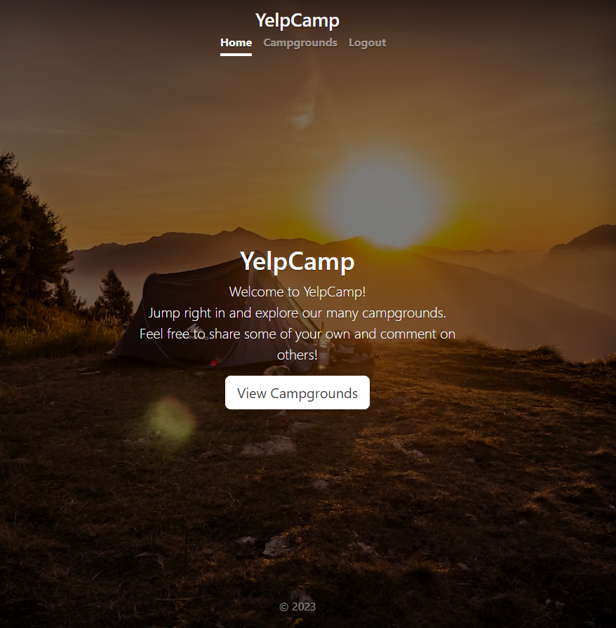
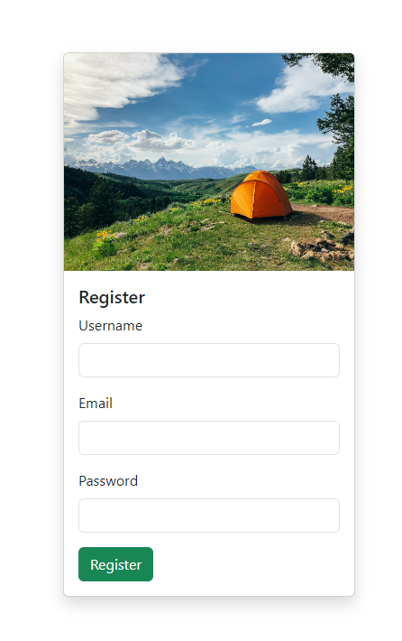
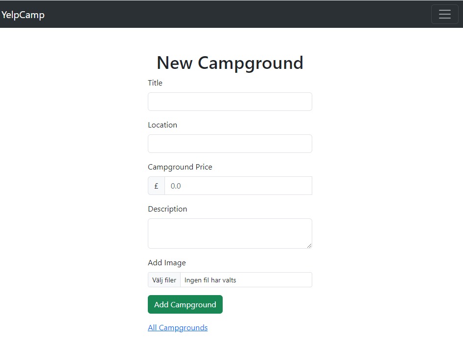
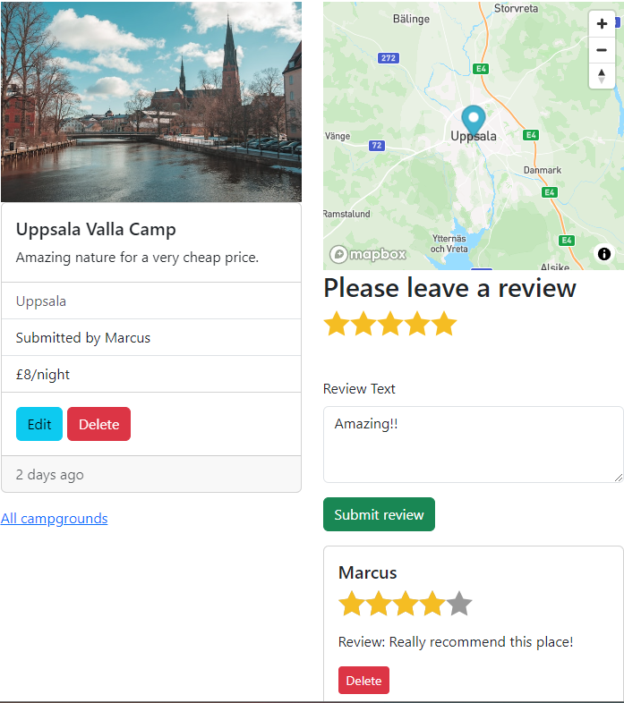
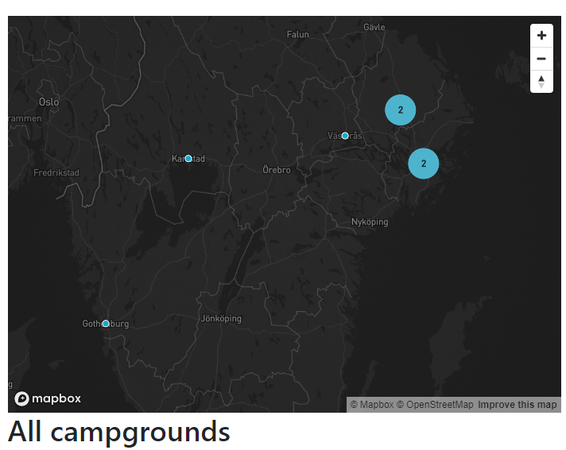

# Yelpcamp

Following project is a website (part of The Web Developer Bootcamp 2023 course by Colt Steele on Udemy) were users can create an account and review or create a campground.

The project includes among other things Express, Node.js, MongoDB, PassportJS and Bootstrap.

## Features

***Register an account and login.***

***Create a new campground***

***View campgrounds and leave reviews or update/delete. All with CRUD functionality***

***View locations on map***

***Other***
* Authorization. One for example cannot edit or delete reviews made by other users.
* Responsive web design.
